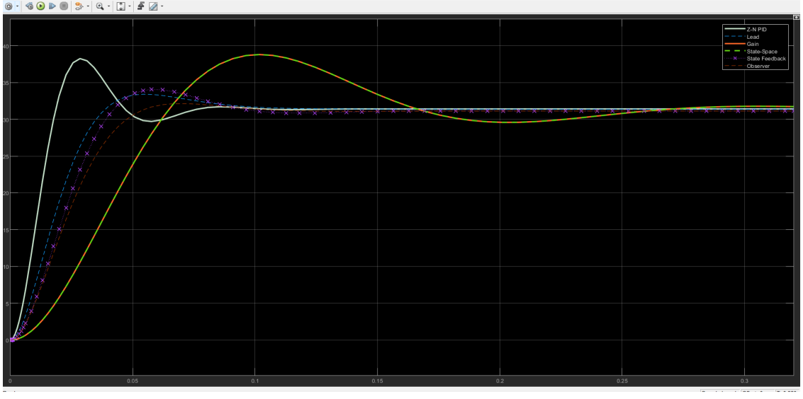
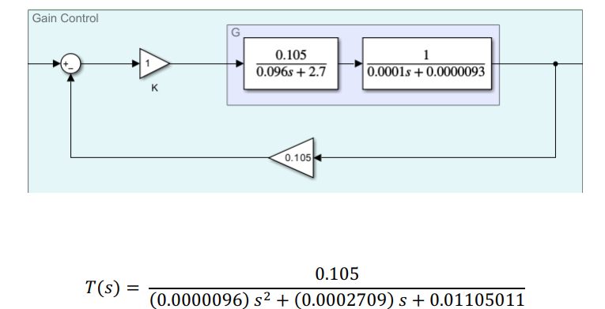

# DC motor siulation and control by Gain / Lead-lag / full-state feedback / full-state feedback with observer / PID
In this project, we plan to implement the mechanism of the opening door of a mobile product delivery robot with control methods.
The control model is a permanent magnet DC motor, which is used to open the top of the robot to remove the product from the inner compartment.
The important points in this model is that it should reach the specified final value in the shortest possible time and with the least overshoot.
This robot has a 24V power supply, in which a drive is used for the motor. It should be by applying the input voltage
 3.3 volts, the motor can reach a speed of 300 RPM within 0.1 second and a maximum of 10% jump.
For us, in this case, permanent error is of little importance. The adverbs of the problem include:
1. The stability of the input voltage.
2. The minimum sitting time is 0.04 seconds (in order not to damage the door in the long term due to static shock)
3. The permissible range of door opening speed (ω) is better between 30 and 32 radians per second.
   
 star if you like it ✨
   
   
   

  
   
  
   

